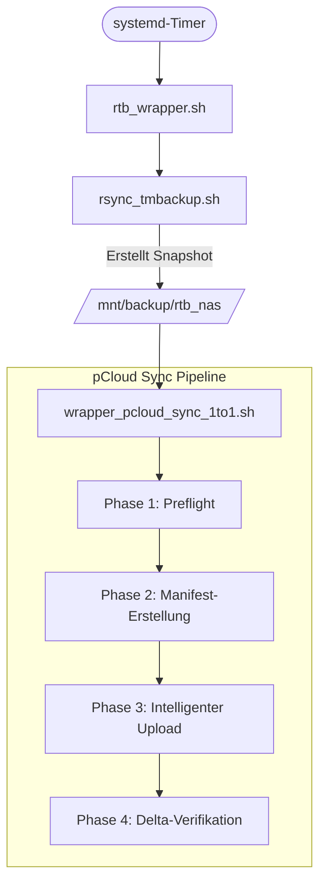

# pCloud-Tools: Architektur & Ablaufkette

> **Stand:** April 2026 · **Status:** Production / Stable

---

## Über dieses Projekt

pCloud-Tools ist eine schlanke, selbst-gehostete Backup-Pipeline, die lokale Rsync-Snapshots automatisch und speichereffizient in die pCloud synchronisiert. Das System läuft vollständig automatisiert als systemd-Timer auf einem Raspberry Pi / NAS und benötigt nach dem initialen Setup keinen manuellen Eingriff mehr.

**Kernproblem, das gelöst wird:** Naive Cloud-Backups kopieren bei jedem Lauf alle Daten neu oder verbrauchen durch traditionelle Versionierung ein Vielfaches des Speicherplatzes. Wer z. B. 90 GB Daten über 30 Snapshots sichert, hat schnell mehrere Terabyte Quotaverbrauch — obwohl sich zwischen zwei Snapshots vielleicht nur 50 MB geändert haben.

**Wie pCloud-Tools das löst:** Jede Datei wird genau einmal physisch auf pCloud gespeichert, in einem zentralen `_index`. Alle Snapshots referenzieren diesen Index über Metadaten-Stubs (sogenannte Anchors). Dadurch belegt ein zweiter Snapshot nur den Speicher der tatsächlich neuen oder geänderten Dateien — unabhängig davon, wie groß der Gesamtbestand ist.

Für die Erstellung eines neuen Snapshots auf pCloud stehen zwei Modi zur Wahl, die automatisch und datengetrieben ausgewählt werden. Wie funktioniert Pcloud-tools genau und welche Voraussetzungen braucht es:

## Zusammenhänge & Ablauf
- **Lokale Backups auf dem NAS (Debian/Linux)** — Die Basis aller Snapshots sind lokale Backups, die mit Standard-Bordmitteln (rsync) erstellt werden. Wir nutzen dafür [rsync-time-backup](https://github.com/laurent22/rsync-time-backup), ein bewährtes Wrapper-Skript, das rsync mit `--link-dest` aufruft. Das entscheidende Merkmal: Unveränderte Dateien werden nicht kopiert, sondern als **Hardlinks** auf den identischen Inode des vorherigen Snapshots gesetzt. Jeder Snapshot sieht damit wie ein vollständiger Stand aus, belegt physisch aber nur den Speicher der tatsächlich geänderten Dateien. Dieses Inode-Sharing auf Dateisystemebene ist auch der Grund, warum das Manifest-Tool (Phase 2) bei unveränderten Dateien auf Hashing verzichten kann: gleicher Inode = kein Hash nötig.
- **Wrapper** — Der gesamte Ablauf wird durch `rtb_wrapper.sh` orchestriert, der von einem systemd-Timer ausgelöst wird. Er startet zunächst rsync-time-backup im Dry-Run, um festzustellen, ob sich seit dem letzten Lauf überhaupt etwas geändert hat. Nur wenn Änderungen erkannt werden, wird das Backup tatsächlich durchgeführt. Danach ruft der Wrapper automatisch `wrapper_pcloud_sync_1to1.sh` auf, der seinerseits Manifest-Erstellung (`pcloud_json_manifest.py`), Upload (`pcloud_push_json_manifest_to_pcloud.py`) und Verifikation (`pcloud_quick_delta.py`) in dieser Reihenfolge ausführt. Jede Phase bekommt dabei die wichtigsten Parameter — Snapshot-Pfad, Referenz-Manifest, Deduplizierungs-Modus — automatisch übergeben, ohne dass manueller Eingriff nötig ist.
- **SAFE-MODE** — Wird  beim allerersten Snapshot nach einem vollständig realen Upload genutzt. Schreibt für jede unveränderte Datei einen Stub statt sie zu kopieren. Das verwandelt den Snapshot in einen reinen Referenz-Stand und aktiviert damit den deutlich schnelleren TURBO-MODE für alle folgenden Läufe.
- **TURBO-MODE** — Klont einen bestehenden Snapshot serverseitig mit einem einzigen API-Call (`copyfolder`), lädt nur die Dateien hoch, die sich seit dem letzten Backup wirklich geändert haben, und löscht entfernte Dateien. Ein typischer Nacht-Lauf mit 50 MB Änderungen an einem 90-GB-Bestand dauert so wenige Minuten und kostet nur minimale API-Calls.

Zusätzlich beschleunigen zwei lokale Caches das System: Das **Index-JSON** vermeidet wiederholte Remote-Abfragen des Deduplizierungs-Index, und das **Folder-Template** erlaubt das Aufbauen der Ordnerstruktur eines neuen Snapshots via `copyfolder` statt über hunderte Einzel-API-Calls.

Das Ergebnis ist ein vollautomatisches, quotaeffizientes Backup-System mit verifizierbarer Integrität nach jedem Lauf.

---

## 1. Gesamtübersicht & Ablauf

Die pCloud-Tools bilden eine automatisierte Backup-Pipeline, die lokale RTB-Snapshots (Rsync Time Backup) effizient in die pCloud synchronisiert. Dabei wird eine globale Deduplizierung auf Block-Ebene (via SHA-256) und serverseitiges Klonen (Delta-Copy) genutzt.



---

## 2. Die Phasen im Detail

### Phase 1 — Preflight
`wrapper_pcloud_sync_1to1.sh` prüft Authentifizierung, Quota und API-Erreichbarkeit. Bei Fehlern wird der Lauf abgebrochen, um Datenkorruption zu vermeiden.

### Phase 2 — Manifest-Erstellung (`pcloud_json_manifest.py`)
Erfasst den Ist-Zustand des lokalen Snapshots.
- **Smart-Mode**: Nutzt das vorherige Manifest als Referenz. Vergleicht `mtime`, `size` und `inode`. Nur geänderte Dateien werden neu gehasht (SHA-256). Beschleunigt den Prozess um den Faktor ~x.

### Phase 3 — Intelligenter Upload (`pcloud_push_json_manifest_to_pcloud.py`)
Das Herzstück der Synchronisation. Es wählt automatisch den effizientesten Weg:

- **TURBO-MODE (Delta-Copy)**: Wenn ein ähnlicher Basis-Snapshot existiert, wird dieser serverseitig geklont (`copyfolder`). Nur die Unterschiede (Deltas) werden durch Uploads oder Löschungen angepasst. (1 API-Call für die Struktur).
- **SAFE-MODE (Stub-Sync)**: Fallback, falls kein guter Basis-Snapshot existiert. Nutzt ein `_folder_template`, um die Ordnerstruktur schnell aufzubauen, und verknüpft Dateien via Stubs (`.meta.json`) mit dem globalen `_index`.

### Phase 4 — Delta-Check (`pcloud_quick_delta.py`)
Post-Upload-Verifizierung. Vergleicht den Live-Zustand auf pCloud mit dem lokalen `content_index.json`. Erkennt fehlende Dateien, Anchor-Inkonsistenzen oder unbefugte Änderungen.

---

## 3. Tool-Inventar

### Kern-Komponenten (Produktion)

- **[pcloud_bin_lib.py](./pcloud_bin_lib.py)**: Zentrale API-Bibliothek für die pCloud Binary-API. Kapselt Verbindung, Error-Handling, Connection-Pooling und komplexe Operationen wie `upload_chunked` oder `copyfolder`.
- **[wrapper_pcloud_sync_1to1.sh](./wrapper_pcloud_sync_1to1.sh)**: Orchestrator der Pipeline. Verwaltet Locks, Logging (JSONL), MariaDB-Tracking und steuert den sequenziellen Aufruf der Python-Tools.
- **[pcloud_json_manifest.py](./pcloud_json_manifest.py)**: Erzeugt Snapshot-Manifeste (Schema v3). Unterstützt Smart-Hashing zur massiven Performance-Steigerung bei inkrementellen Backups.
- **[pcloud_push_json_manifest_to_pcloud.py](./pcloud_push_json_manifest_to_pcloud.py)**: Synchronisiert Manifeste nach pCloud. Verwaltet den globalen Deduplizierungs-Index und implementiert die Delta-Copy-Logik.
- **[pcloud_quick_delta.py](./pcloud_quick_delta.py)**: Schnelles Monitoring-Tool zur Integritätsprüfung direkt nach dem Upload.

### Wartung & Diagnose (Manuell)

- **[pcloud_integrity_check.py](./pcloud_integrity_check.py)**: Tiefenprüfung der gesamten Backup-Struktur (Hashes, FileIDs, Holder-Konsistenz).
- **[pcloud_repair_index.py](./pcloud_repair_index.py)**: Repariert den Index nach erkannten Fehlern (z.B. Entfernen von "Phantom-Anchors").
- **[pcloud_restore.py](./pcloud_restore.py)**: Stellt Snapshots von pCloud wieder her. Nutzt den Index, um de-duplizierte Daten korrekt zusammenzuführen.
- **[pcloud_verify_index_vs_manifests.py](./pcloud_verify_index_vs_manifests.py)**: Gleicht den Remote-Index gegen die lokalen Manifeste (Ground Truth) ab.
- **[fix_stubs_missing_fileid.py](./fix_stubs_missing_fileid.py)**: Repariert Metadaten-Stubs, denen die FileID fehlt (v.a. nach API-Fehlern).
- **[rewrite_stubs_from_index.py](./rewrite_stubs_from_index.py)**: Regeneriert alle Stubs eines Snapshots basierend auf dem aktuellen Index.

### Monitoring & Status

- **[pcloud_status.sh](./pcloud_status.sh)**: Interaktives Dashboard zur Abfrage der Backup-Historie aus MariaDB (inkl. HTML-Export).
- **[pcloud_health_check.sh](./pcloud_health_check.sh)**: Monitor für Backup-Alter, Quota und Systemzustand. Nagios/Zabbix-kompatibel.

---

## 4. Datenstrukturen

### Lokal (`/srv/pcloud-archive/`)
- `manifests/`: Archiv aller Snapshot-Manifeste.
- `indexes/content_index.json`: Lokaler Cache des globalen Deduplizierungs-Index.
- `deltas/`: Berichte der Integritätsprüfungen.

### Remote (`/Backup/rtb_1to1/`)
- `_snapshots/`: Enthält die tatsächlichen Snapshot-Ordner.
- `_index/`: Beherbergt den Master-Index und die physischen Datei-Anchors.
- `_folder_template/`: Cache für schnelle Verzeichnisstrukturen im SAFE-MODE.

---

## 5. Logik: SAFE vs. TURBO Mode

```mermaid
flowchart TD
    Start[Start Phase 3] --> CheckRatio{Stub-Ratio >= 50% \n & Files >= 100?}
    CheckRatio -- "Ja" --> Turbo[TURBO-MODE: \n copyfolder(prev_snap) \n + Delta-Sync]
    CheckRatio -- "Nein" --> Safe[SAFE-MODE: \n Stub-Sync]
    Safe --> Template{Overlap >= 70%?}
    Template -- "Ja" --> CopyTemp[copyfolder(_folder_template) \n + Delta-Sync]
    Template -- "Nein" --> Manual[Manuelles Anlegen \n ensure_path]
```

---
