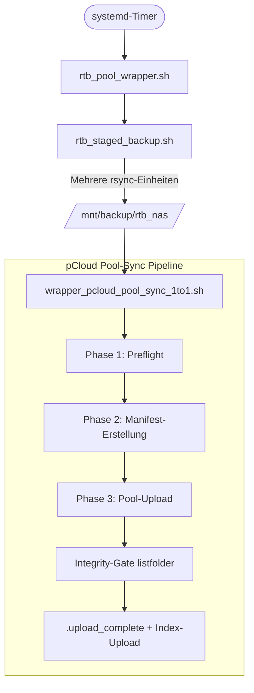

# pCloud-Tools: Architektur & Ablaufkette

> **Stand:** August 2026 · **Status:** Production / Stable · **Modus:** Pool-only

---

## Über dieses Projekt

pCloud-Tools ist eine schlanke, selbst-gehostete Backup-Pipeline, die lokale Rsync-Snapshots automatisch und speichereffizient in die pCloud synchronisiert. Das System läuft vollständig automatisiert als systemd-Timer auf einem Raspberry Pi / NAS und benötigt nach dem initialen Setup keinen manuellen Eingriff mehr.

**Kernproblem, das gelöst wird:** Naive Cloud-Backups kopieren bei jedem Lauf alle Daten neu oder verbrauchen durch traditionelle Versionierung ein Vielfaches des Speicherplatzes. Wer z. B. 90 GB Daten über 30 Snapshots sichert, hat schnell mehrere Terabyte Quotaverbrauch — obwohl sich zwischen zwei Snapshots vielleicht nur 50 MB geändert haben.

**Wie pCloud-Tools das löst:** Jede Datei wird genau einmal physisch im `_pool` gespeichert (SHA256 als Dateiname, 2-Level-Struktur `_pool/XX/<sha256>`). Alle Snapshots referenzieren den Pool über Metadaten-Stubs (`_snapshots/<snap>/<relpath>.meta.json`). Ein Master-Index (`_snapshots/_index/content_index.json`) hält alle SHA→{fileid, pcloud_hash, size, snapshots} Zuordnungen. Dadurch belegt ein zweiter Snapshot nur den Speicher der tatsächlich neuen oder geänderten Dateien.

---

## Zusammenhänge & Ablauf

- **Lokale Backups auf dem NAS** — [rsync-time-backup](https://github.com/laurent22/rsync-time-backup) (`rsync_tmbackup.sh`) **unverändert**; `rtb_pool_wrapper.sh` ruft standardmäßig `rtb_staged_backup.sh` auf (mehrere rsync-Einheiten pro Snapshot, RAM ~600 MB/Einheit statt ~5 GB monolithisch). Hardlinks via `--link-dest` pro Teilpfad.

- **Orchestrator** — `rtb_pool_wrapper.sh` (Repo `rtb`) wird vom systemd-Timer ausgelöst. Gemeinsamer **NAS Heavy-Ops-Lock** (`/run/backup_pipeline.lock`) mit ClamAV/Entropy-Scans. Offenes Staged-Resume (`backup.inprogress` + `.rtb_staged_active`) überspringt den Delta-Check. Nach RTB: `wrapper_pcloud_pool_sync_1to1.sh` im Catch-up-Modus (**latest zuerst**, dann Backlog).

- **pCloud-Sync** — `wrapper_pcloud_pool_sync_1to1.sh` orchestriert: Manifest-Erstellung, Pool-Upload und Verifikation pro Snapshot. EntropyWatcher Safety-Gate vor dem Backup. MariaDB-Phasen-Logging.

---

## 1. Gesamtübersicht & Ablauf


```mermaid
flowchart TD
    Timer([systemd-Timer]) --> RTB_Wrapper[rtb_pool_wrapper.sh]
    RTB_Wrapper --> STAGED[rtb_staged_backup.sh]
    STAGED -- "Mehrere rsync-Einheiten" --> NAS_DIR[/mnt/backup/rtb_nas/]
    NAS_DIR --> PCLOUD_WRAPPER[wrapper_pcloud_pool_sync_1to1.sh]

    subgraph Pipeline [pCloud Pool-Sync Pipeline]
    PCLOUD_WRAPPER --> P1[Phase 1: Preflight]
    P1 --> P2[Phase 2: Manifest-Erstellung]
    P2 --> P3[Phase 3: Pool-Upload]
    P3 --> P4[Integrity-Gate listfolder]
    P4 --> P5[.upload_complete + Index-Upload]
    end
```

---

## 2. Die Phasen im Detail

### Phase 1 — Preflight
Prüft pCloud-Authentifizierung, Quota und API-Erreichbarkeit. Bei Fehlern: Abbruch.

### Phase 2 — Manifest-Erstellung (`pcloud_json_pool_manifest.py`)
Erfasst den Ist-Zustand des lokalen Snapshots: relpath, sha256, size, mtime, inode.
- **Smart-Mode**: Auto-Pick nach Scan (max. 6 chronologisch nächste Kandidaten, mtime/size-Deckung); ein Walk.

### Phase 3 — Pool-Upload (`pcloud_push_json_pool_manifest_to_pcloud.py`)
Wählt automatisch den effizientesten Upload-Modus:

- **Turbo-Delta-Mode**: Scout (`scout_pool_basis`) wählt chronologischen Vorgänger oder besten Jaccard unter **älteren** Remote-Snaps (nie neuerer Snap als Basis). Bei ≥ 70 % Similarity: `copyfolder` + Diff. Phase 3 Cleanup parallel (`PCLOUD_DELTA_CLEANUP_THREADS`).
- **Full-Pool-Mode**: Fallback bei < 70 % Similarity oder Scout deaktiviert. Delta-Fehler → Full mit `use_scout=False` (keine Rekursion).

Nach Stubs/Index-Pflege: **Integrity-Gate** (`_post_upload_gate` in `pcloud_push_json_pool_manifest_to_pcloud.py`):

1. **Default:** `pool_verify_backup` per `listfolder` (~30–60 s) — Manifest-SHAs vs. Pool, Stubs vs. Manifest
2. **Optional:** Pool-Backfill bei wenigen fehlenden SHAs (`PCLOUD_VALIDATE_POOL_BACKFILL_MAX`, Default 50)
3. **DB:** `integrity_status` / `post_upload` via `pool_integrity_run.py` (im Gate, nicht im Wrapper)
4. Nur bei **OK** → `.upload_complete` setzen → danach Index-Upload (lokal auf SSD, resumable)

**Legacy (optional):** `PCLOUD_VALIDATE_UPLOAD=1` aktiviert die alte Massen-`stat()`-Validation (~40 Min).  
**Wrapper:** `PCLOUD_POST_UPLOAD_INTEGRITY=skip` (Default) — kein redundanter zweiter Integritätslauf.

### Phase 5 — tamper-detect / Audit (manuell oder Timer)
Vergleicht den Live-Zustand auf pCloud mit dem Master-Index (v2, Pool-Modus). Prüft pro SHA256: fileid, pcloud_hash, size, Stub-Existenz. Erkennt fehlende Pool-Objekte und Abweichungen. **Verwaiste Pool-Objekte** (physisch in `_pool/`, nicht in `pool_refs`) sind GC-Hinweise — kein kritischer Pipeline-Fehler (Juni 2026).

---

## 3. Tool-Inventar

### Kern-Komponenten (Produktion)

| Tool | Zweck |
|---|---|
| `pcloud_bin_lib.py` | Zentrale API-Bibliothek: Verbindung, Circuit Breaker (Cooldown/Half-Open), `copyfolder`, chunked Upload, `scout_pool_basis` |
| `wrapper_pcloud_pool_sync_1to1.sh` | Orchestrator: NAS-Lock, Logging, MariaDB-Tracking, Catch-up-Loop |
| `pcloud_json_pool_manifest.py` | Manifest-Erstellung (Schema v4): SHA256, Smart-Mode, inode-Cache |
| `pcloud_push_json_pool_manifest_to_pcloud.py` | Pool-Upload: Scout, Turbo-Delta, Full-Pool, Validation, Index-Management |
| `legacy/pcloud_quick_delta.py` | tamper-detect CLI (1to1 + manuell Pool); Wrapper nutzt `pool_integrity_run.py` |
| `pcloud_pool_gc.py` | Garbage Collection: entfernt Pool-Objekte ohne Index-Referenz (REST-Delete via Lib, Grace Period) |

### Wartung & Diagnose (Manuell)

| Tool | Zweck |
|---|---|
| `scripts/utilities/pool_check_remote.py` | Read-only: .upload_complete, Stub-Anzahl, Pool-SHAs |
| `scripts/utilities/pool_delta_plan.py` | Offline: Delta vs. Full planen, Catch-up-Simulation |
| `scripts/utilities/pool_verify_backup.py` | Vollständiger Integritätscheck: Manifest→Pool (SHA-Set), Manifest→Stubs (100%), optional Stub-Inhalt |
| `scripts/utilities/pool_rebuild_index_v2.py` | Rebuild des v2-Index aus lokalen Manifesten × Remote-Pool |
| `scripts/utilities/pool_archive_index.py` | Erzeugt gefilterte per-Snapshot-Archivindizes |
| `scripts/utilities/check_undefined_names.py` | Stdlib-Checker für undefinierte Namen (Ersatz für pyflakes) |

### Monitoring & Status

- **MariaDB** (`pcloud_backup`): `backup_runs` + `backup_phases` — jeder Lauf wird getrackt
- **Delta-Reports**: `/srv/pcloud-archive/deltas/delta_verify_<snap>.json`

---

## 4. Datenstrukturen

### Lokal (`/srv/pcloud-archive/`)
```
manifests/          ← per-Snapshot-Manifeste (relpath, sha256, mtime, size, inode)
indexes/            ← content_index_master.json (lokaler Spiegel des Remote-Index)
deltas/             ← tamper-detect Reports
```

### Remote (`/Backup/rtb_pool/`)
```
_pool/
  XX/               ← 256 Ordner (00-FF, erster Byte des sha256)
    <sha256>        ← physische Datei (Originalinhalt, einmal gespeichert)

_snapshots/
  <snap>/
    <relpath>.meta.json   ← Stub: sha256, pool_fileid, pcloud_hash, size, mtime
    .upload_started        ← Upload läuft
    .upload_complete       ← Snapshot vollständig und validiert

  _index/
    content_index.json    ← Master-Index v2: pool_refs{sha→{fileid,hash,size,snapshots{snap:[relpaths]}}}
    archive/
      <snap>_index.json   ← gefilterte per-Snapshot-Kopie für Recovery
```

---

## 5. Pool-Modi

```mermaid
flowchart TD
    Start[Start Phase 3] --> Scout{Scout: Similarity\nzum besten Remote-Snap?}
    Scout -- ">= 70%" --> Turbo[Turbo-Delta-Mode:\ncopyfolder(chrono basis) + Diff\nPhase 3 parallel]
    Scout -- "< 70%" --> Full[Full-Pool-Mode:\nPool-Preflight + Delta-SHAs\n→ Upload + Ordnerstruktur]
    Turbo --> Gate[Integrity-Gate\nlistfolder ~30–60s\noptional Pool-Backfill]
    Full --> Gate
    Gate -- "OK" --> Complete[.upload_complete + Index-Upload]
    Gate -- "FAIL" --> NoComplete[Kein Marker → nächster Lauf\nwipet und startet neu]
```

---

## 6. SystemD Integration & CLI-Tool Ausnahme (env -u Pattern)

### Problem: EntropyWatcher als CLI-Tool vs. Service

EntropyWatcher wird aus zwei Kontexten aufgerufen:

1. **Als systemd-Service** (`entropywatcher-nas.service`): Hat `INVOCATION_ID`. Das Skript crasht absichtlich bei `--env` Flag (Schutz vor Fehlkonfiguration).
2. **Als CLI-Tool** in `safety_gate.sh`: Ruft Status-Abfragen auf, braucht `--env` Flag.

**Das Dilemma:** Wenn `safety_gate.sh` von einem systemd-Service aufgerufen wird, erbt der Python-Prozess `INVOCATION_ID` und crasht.

### Lösung: Selektive Umgebungsbereinigung mit `env -u`

```bash
# In safety_gate.sh (EntropyWatcher-Repo)
CLEAN_CALL="env -u INVOCATION_ID -u JOURNAL_STREAM -u NOTIFY_SOCKET"
$CLEAN_CALL /opt/apps/entropywatcher/main/entropywatcher.py --env nas status
```

`env -u VARIABLE` entfernt die Variable nur für diesen einen Subprozess. Andere Prozesse behalten die Original-Umgebung. Der EntropyWatcher sieht keine systemd-Variablen mehr und erlaubt den `--env` Flag.

**Ablauf:**
1. `backup-pipeline.service` → `rtb_pool_wrapper.sh` → `safety_gate.sh`
2. `safety_gate.sh` startet `entropywatcher.py` mit `env -u`
3. Statusabfrage funktioniert → Safety-Gate gibt Exitcode 0/1/2

Verwandte Komponenten: `rtb_pool_wrapper.sh`, `nas_heavy_ops_lock.sh` (rtb-Repo), `safety_gate.sh` (EntropyWatcher-Repo).

→ Cross-Repo-Betrieb: Doku-Repo `doku/Raspi/raspinas/pcloud-tools/OPERATIONS_2026-08.md`  
→ Änderungslog: [CHANGELOG_2026-08.md](CHANGELOG_2026-08.md)

---
