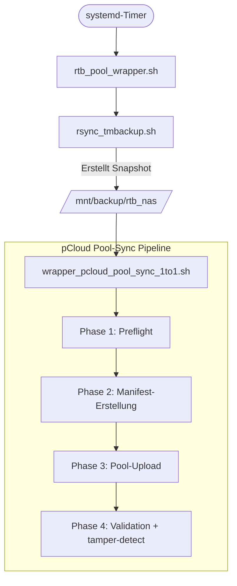

# pCloud-Tools: Architektur & Ablaufkette

> **Stand:** Juni 2026 · **Status:** Production / Stable · **Modus:** Pool-only

---

## Über dieses Projekt

pCloud-Tools ist eine schlanke, selbst-gehostete Backup-Pipeline, die lokale Rsync-Snapshots automatisch und speichereffizient in die pCloud synchronisiert. Das System läuft vollständig automatisiert als systemd-Timer auf einem Raspberry Pi / NAS und benötigt nach dem initialen Setup keinen manuellen Eingriff mehr.

**Kernproblem, das gelöst wird:** Naive Cloud-Backups kopieren bei jedem Lauf alle Daten neu oder verbrauchen durch traditionelle Versionierung ein Vielfaches des Speicherplatzes. Wer z. B. 90 GB Daten über 30 Snapshots sichert, hat schnell mehrere Terabyte Quotaverbrauch — obwohl sich zwischen zwei Snapshots vielleicht nur 50 MB geändert haben.

**Wie pCloud-Tools das löst:** Jede Datei wird genau einmal physisch im `_pool` gespeichert (SHA256 als Dateiname, 2-Level-Struktur `_pool/XX/<sha256>`). Alle Snapshots referenzieren den Pool über Metadaten-Stubs (`_snapshots/<snap>/<relpath>.meta.json`). Ein Master-Index (`_snapshots/_index/content_index.json`) hält alle SHA→{fileid, pcloud_hash, size, snapshots} Zuordnungen. Dadurch belegt ein zweiter Snapshot nur den Speicher der tatsächlich neuen oder geänderten Dateien.

---

## Zusammenhänge & Ablauf

- **Lokale Backups auf dem NAS** — Die Basis aller Snapshots sind lokale Backups mit [rsync-time-backup](https://github.com/laurent22/rsync-time-backup) (`rsync_tmbackup.sh`). Unveränderte Dateien werden als **Hardlinks** gesetzt — gleicher Inode = kein Re-Hash nötig.

- **Orchestrator** — `rtb_pool_wrapper.sh` wird vom systemd-Timer ausgelöst. Er führt zuerst einen rsync Dry-Run durch (Änderungen seit letztem Snapshot?), ruft bei Bedarf `rsync_tmbackup.sh` auf, und startet danach automatisch `wrapper_pcloud_pool_sync_1to1.sh` im Catch-up-Modus. Catch-up: **`latest` zuerst**, dann älteres Backlog chronologisch; ein fehlgeschlagener Backlog-Snapshot blockiert juengere nicht (weiter mit `continue`). Harte Abbrüche nur bei `--upload-only` / explizitem Target.

- **pCloud-Sync** — `wrapper_pcloud_pool_sync_1to1.sh` orchestriert: Manifest-Erstellung, Pool-Upload und Verifikation pro Snapshot. Mit EntropyWatcher Safety-Gate-Check vor dem Backup.

---

## 1. Gesamtübersicht & Ablauf


```mermaid
flowchart TD
    Timer([systemd-Timer]) --> RTB_Wrapper[rtb_pool_wrapper.sh]
    RTB_Wrapper --> RSYNC[rsync_tmbackup.sh]
    RSYNC -- "Erstellt Snapshot" --> NAS_DIR[/mnt/backup/rtb_nas/]
    NAS_DIR --> PCLOUD_WRAPPER[wrapper_pcloud_pool_sync_1to1.sh]

    subgraph Pipeline [pCloud Pool-Sync Pipeline]
    PCLOUD_WRAPPER --> P1[Phase 1: Preflight]
    P1 --> P2[Phase 2: Manifest-Erstellung]
    P2 --> P3[Phase 3: Pool-Upload]
    P3 --> P4[Phase 4: Validation + tamper-detect]
    end
```

---

## 2. Die Phasen im Detail

### Phase 1 — Preflight
Prüft pCloud-Authentifizierung, Quota und API-Erreichbarkeit. Bei Fehlern: Abbruch.

### Phase 2 — Manifest-Erstellung (`pcloud_json_pool_manifest.py`)
Erfasst den Ist-Zustand des lokalen Snapshots: relpath, sha256, size, mtime, inode.
- **Smart-Mode**: Nutzt das vorherige Manifest als Referenz. Vergleicht `mtime`, `size` und `inode`. Nur geänderte Dateien werden neu gehasht. ~40× schneller als Full-Hash.

### Phase 3 — Pool-Upload (`pcloud_push_json_pool_manifest_to_pcloud.py`)
Wählt automatisch den effizientesten Upload-Modus:

- **Turbo-Delta-Mode**: Der Scout berechnet Jaccard-Similarity zwischen aktuellem Manifest und allen Remote-Snapshots. Bei ≥ 70% wird der beste Basis-Snapshot serverseitig geklont (`copyfolder`) und nur die Differenz hochgeladen. Typischer Lauf mit 50 MB Änderungen: wenige Minuten.
- **Full-Pool-Mode**: Fallback bei < 70% Similarity (erster Snapshot eines neuen Geräts). Lädt alle nicht-im-Pool-befindlichen Dateien hoch, baut Ordnerstruktur für Stubs auf.

Nach dem Upload: Post-Upload-Validation (100% Stub-Coverage-Check via listfolder, Pool-SHA-Check, Index-Konsistenz). Nur bei erfolgreicher Validation wird `.upload_complete` gesetzt.

### Phase 4 — tamper-detect (`pcloud_quick_delta.py`)
Vergleicht den Live-Zustand auf pCloud mit dem Master-Index (v2, Pool-Modus). Prüft pro SHA256: fileid, pcloud_hash, size, Stub-Existenz. Erkennt fehlende Pool-Objekte, Abweichungen oder verwaiste Objekte.

---

## 3. Tool-Inventar

### Kern-Komponenten (Produktion)

| Tool | Zweck |
|---|---|
| `pcloud_bin_lib.py` | Zentrale API-Bibliothek: Verbindung, Error-Handling, `copyfolder`, chunked Upload |
| `wrapper_pcloud_pool_sync_1to1.sh` | Orchestrator: Lock, Logging, MariaDB-Tracking, Catch-up-Loop |
| `pcloud_json_pool_manifest.py` | Manifest-Erstellung (Schema v4): SHA256, Smart-Mode, inode-Cache |
| `pcloud_push_json_pool_manifest_to_pcloud.py` | Pool-Upload: Scout, Turbo-Delta, Full-Pool, Validation, Index-Management |
| `pcloud_quick_delta.py` | tamper-detect: v2-Index (pool_refs), Pool-Objekte, Stubs |
| `pcloud_pool_gc.py` | Garbage Collection: entfernt Pool-Objekte ohne Index-Referenz |

### Wartung & Diagnose (Manuell)

| Tool | Zweck |
|---|---|
| `scripts/utilities/pool_check_remote.py` | Read-only: .upload_complete, Stub-Anzahl, Pool-SHAs |
| `scripts/utilities/pool_verify_backup.py` | Vollständiger Integritätscheck: Manifest→Pool (SHA-Set), Manifest→Stubs (100%), optional Stub-Inhalt |
| `scripts/utilities/pool_rebuild_index_v2.py` | Rebuild des v2-Index aus lokalen Manifesten × Remote-Pool |
| `scripts/utilities/pool_archive_index.py` | Erzeugt gefilterte per-Snapshot-Archivindizes |
| `scripts/utilities/check_undefined_names.py` | Stdlib-Checker für undefinierte Namen (Ersatz für pyflakes) |

### Monitoring & Status

- **MariaDB** (`pcloud_backup`): `backup_runs` + `backup_phases` — jeder Lauf wird getrackt
- **Delta-Reports**: `/srv/pcloud-archive/deltas/delta_verify_<snap>.json`

---

## 4. Datenstrukturen

### Lokal (`/srv/pcloud-archive/`)
```
manifests/          ← per-Snapshot-Manifeste (relpath, sha256, mtime, size, inode)
indexes/            ← content_index_master.json (lokaler Spiegel des Remote-Index)
deltas/             ← tamper-detect Reports
```

### Remote (`/Backup/rtb_pool/`)
```
_pool/
  XX/               ← 256 Ordner (00-FF, erster Byte des sha256)
    <sha256>        ← physische Datei (Originalinhalt, einmal gespeichert)

_snapshots/
  <snap>/
    <relpath>.meta.json   ← Stub: sha256, pool_fileid, pcloud_hash, size, mtime
    .upload_started        ← Upload läuft
    .upload_complete       ← Snapshot vollständig und validiert

  _index/
    content_index.json    ← Master-Index v2: pool_refs{sha→{fileid,hash,size,snapshots{snap:[relpaths]}}}
    archive/
      <snap>_index.json   ← gefilterte per-Snapshot-Kopie für Recovery
```

---

## 5. Pool-Modi

```mermaid
flowchart TD
    Start[Start Phase 3] --> Scout{Scout: Similarity\nzum besten Remote-Snap?}
    Scout -- ">= 70%" --> Turbo[Turbo-Delta-Mode:\ncopyfolder(basis) + Diff\n→ nur Deltas uploaden]
    Scout -- "< 70%" --> Full[Full-Pool-Mode:\nPool-Preflight + Delta-SHAs\n→ Upload + Ordnerstruktur]
    Turbo --> Validate[Post-Upload-Validation\n100% Stub-Check, Pool-SHA, Index]
    Full --> Validate
    Validate -- "OK" --> Complete[.upload_complete setzen]
    Validate -- "FAIL" --> NoComplete[Kein Marker → nächster Lauf\nwipet und startet neu]
```

---

## 6. SystemD Integration & CLI-Tool Ausnahme (env -u Pattern)

### Problem: EntropyWatcher als CLI-Tool vs. Service

EntropyWatcher wird aus zwei Kontexten aufgerufen:

1. **Als systemd-Service** (`entropywatcher-nas.service`): Hat `INVOCATION_ID`. Das Skript crasht absichtlich bei `--env` Flag (Schutz vor Fehlkonfiguration).
2. **Als CLI-Tool** in `safety_gate.sh`: Ruft Status-Abfragen auf, braucht `--env` Flag.

**Das Dilemma:** Wenn `safety_gate.sh` von einem systemd-Service aufgerufen wird, erbt der Python-Prozess `INVOCATION_ID` und crasht.

### Lösung: Selektive Umgebungsbereinigung mit `env -u`

```bash
# In safety_gate.sh (EntropyWatcher-Repo)
CLEAN_CALL="env -u INVOCATION_ID -u JOURNAL_STREAM -u NOTIFY_SOCKET"
$CLEAN_CALL /opt/apps/entropywatcher/main/entropywatcher.py --env nas status
```

`env -u VARIABLE` entfernt die Variable nur für diesen einen Subprozess. Andere Prozesse behalten die Original-Umgebung. Der EntropyWatcher sieht keine systemd-Variablen mehr und erlaubt den `--env` Flag.

**Ablauf:**
1. `backup-pipeline.service` → `rtb_pool_wrapper.sh` → `safety_gate.sh`
2. `safety_gate.sh` startet `entropywatcher.py` mit `env -u`
3. Statusabfrage funktioniert → Safety-Gate gibt Exitcode 0/1/2

Verwandte Komponenten: `rtb_pool_wrapper.sh`, `safety_gate.sh` (EntropyWatcher-Repo).

---
