# Gap-Handling: Workflow-Diagramme

Visuelle Darstellung der Gap-Handling-Workflows mit Mermaid-Diagrammen.

---

## 📊 Hauptworkflow: Gap-Detection & Handling

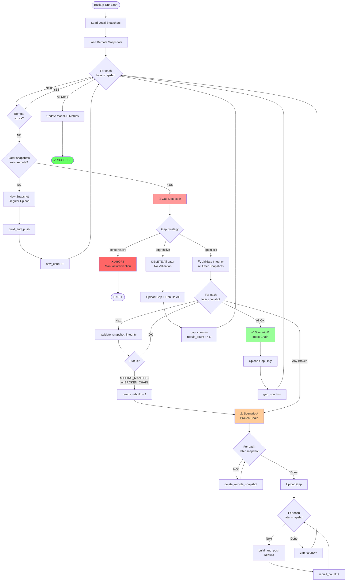

---

## 🔍 Integritäts-Validierung (validate_snapshot_integrity)

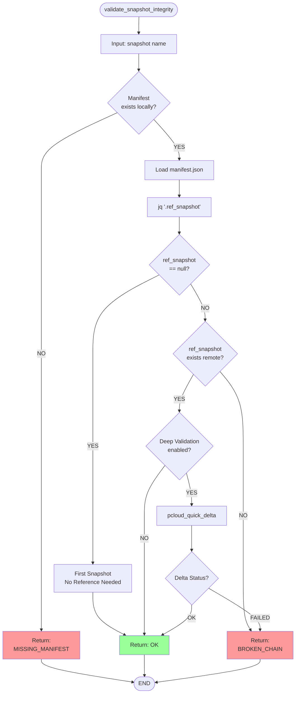

---

## 🗑️ Remote-Snapshot-Löschung (delete_remote_snapshot)

```mermaid
flowchart TD
    Start([delete_remote_snapshot]) --> Input[Input: snapshot name]
    Input --> Log[_log INFO 'Deleting...' ]
    Log --> Python[Python Inline Script]
    Python --> LoadLib[import pcloud_bin_lib]
    LoadLib --> GetConfig[effective_config]
    GetConfig --> BuildPath[Construct snap_path]
    BuildPath --> Path[/Backup/rtb_1to1/_snapshots/NAME]
    
    Path --> APICall{delete_folder API}
    APICall -->|Success| ReturnOK[print 'OK']
    ReturnOK --> ExitSuccess([EXIT 0])
    
    APICall -->|Error| ReturnErr[print ERROR to stderr]
    ReturnErr --> ExitFail([EXIT 1])
    
    style ExitSuccess fill:#99ff99
    style ExitFail fill:#ff9999
```

---

## 📋 Scenario-Vergleich (Side-by-Side)

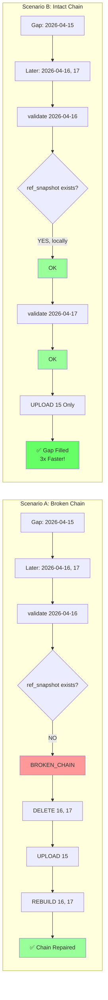

---

## 🎯 Strategie-Entscheidungsbaum

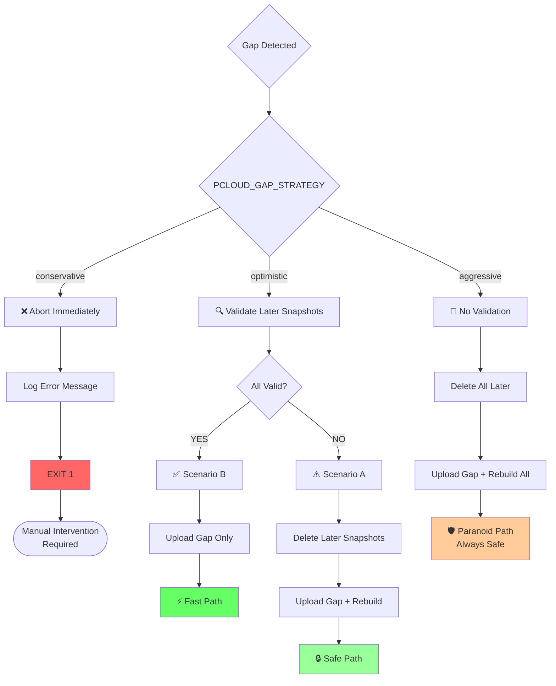

---

## ⏱️ Performance-Vergleich (Timeline)

```mermaid
gantt
    title Gap-Handling Performance (150 GB per Snapshot)
    dateFormat HH:mm
    axisFormat %H:%M
    
    section Scenario A (Broken)
    Validation (10s)           :a1, 00:00, 1m
    Delete Later (2min)        :a2, 00:01, 2m
    Upload Gap (7h)            :a3, 00:03, 420m
    Rebuild 2026-04-16 (7h)    :a4, 07:03, 420m
    Rebuild 2026-04-17 (7h)    :a5, 14:03, 420m
    Total: 21h                 :milestone, 21:03, 0m
    
    section Scenario B (Optimistic)
    Validation (10s)           :b1, 00:00, 1m
    Upload Gap ONLY (7h)       :b2, 00:01, 420m
    Done!                      :milestone, 07:01, 0m
    
    section Scenario B (Aggressive)
    No Validation              :c1, 00:00, 0m
    Delete Later (2min)        :c2, 00:00, 2m
    Upload Gap (7h)            :c3, 00:02, 420m
    Rebuild 16 (7h)            :c4, 07:02, 420m
    Rebuild 17 (7h)            :c5, 14:02, 420m
    Total: 21h (WASTE!)        :milestone, 21:02, 0m
```

**Legende:**
- **Scenario A (Broken):** Rebuild nötig → 21h (korrekt)
- **Scenario B (Optimistic):** Nur Gap → 7h (**3x schneller**)
- **Scenario B (Aggressive):** Unnötiger Rebuild → 21h (14h verschwendet!)

---

## 🔄 Build & Push Workflow (build_and_push)

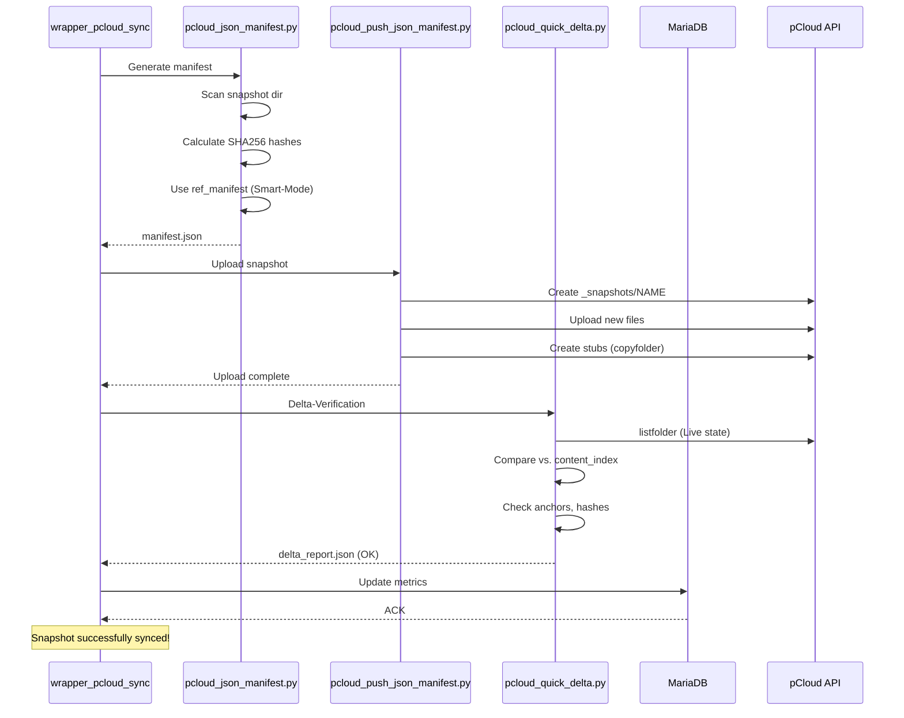

---

## 🔍 Gap-Erkennung (Detection-Algorithmus)

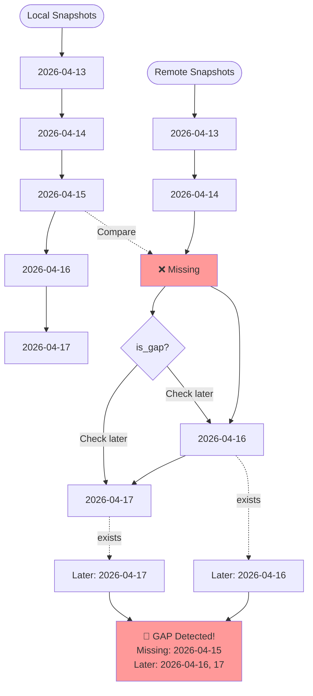

---

## 🎨 State-Machine (Gap-Handling-States)

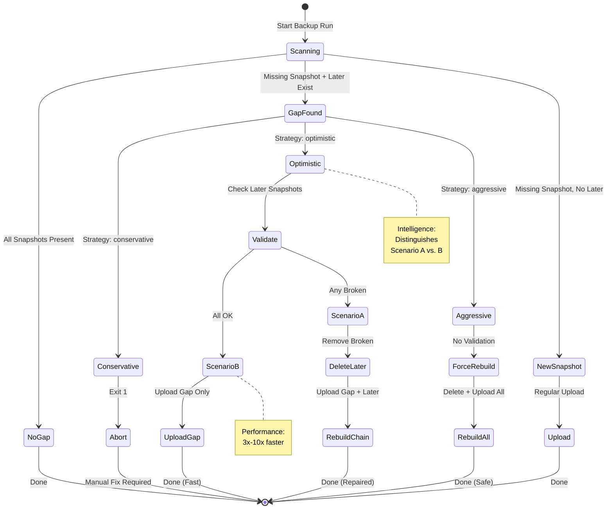

---

## 📊 Metrics Update Flow

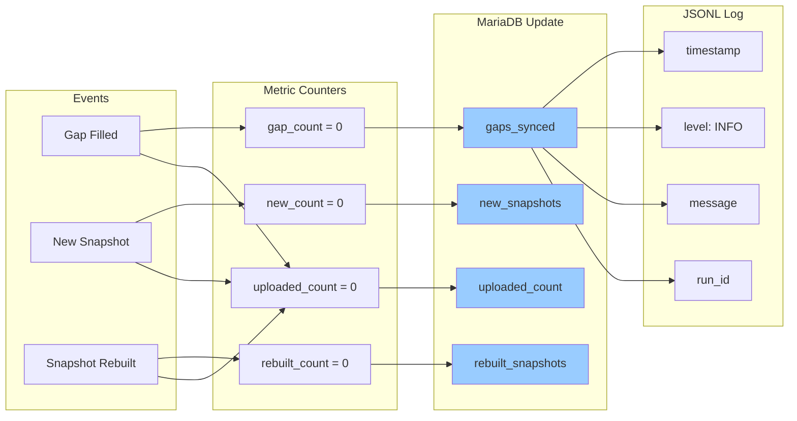

---

## 🧪 Testing-Workflows

### Test 1: Conservative Mode

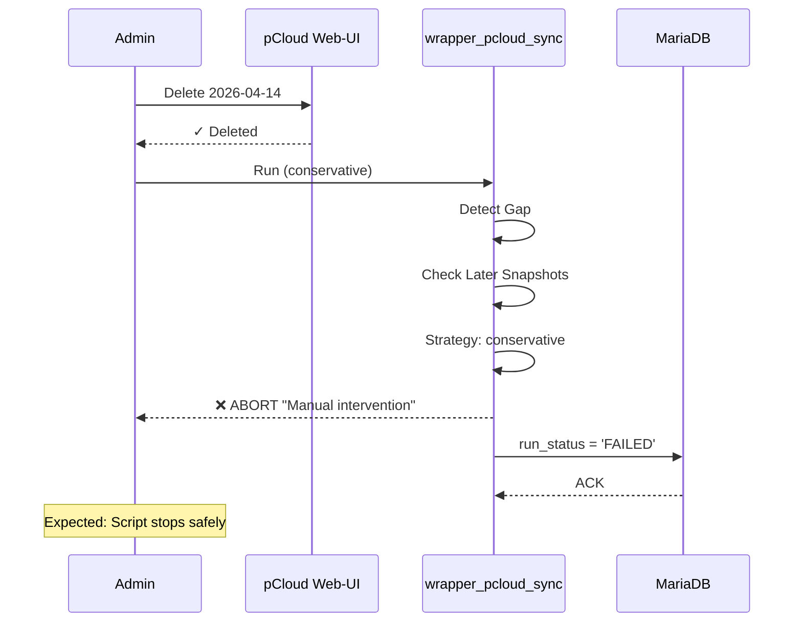

---

### Test 2: Optimistic Scenario B

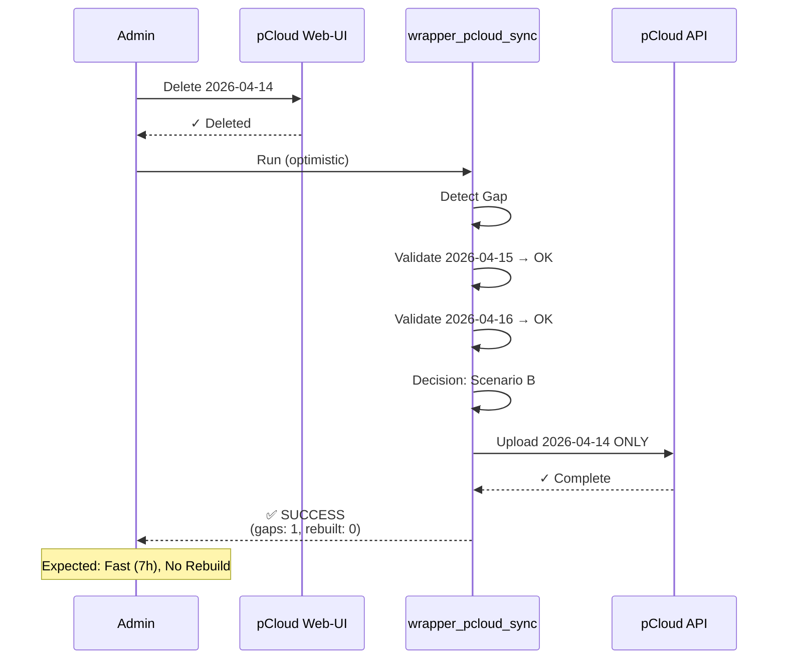

---

### Test 3: Optimistic Scenario A

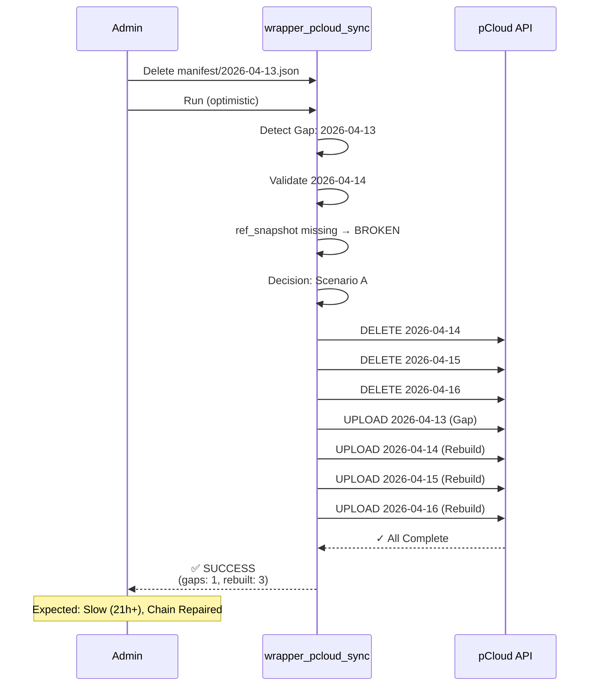

---

## 🔗 Integration mit RTB-Pipeline

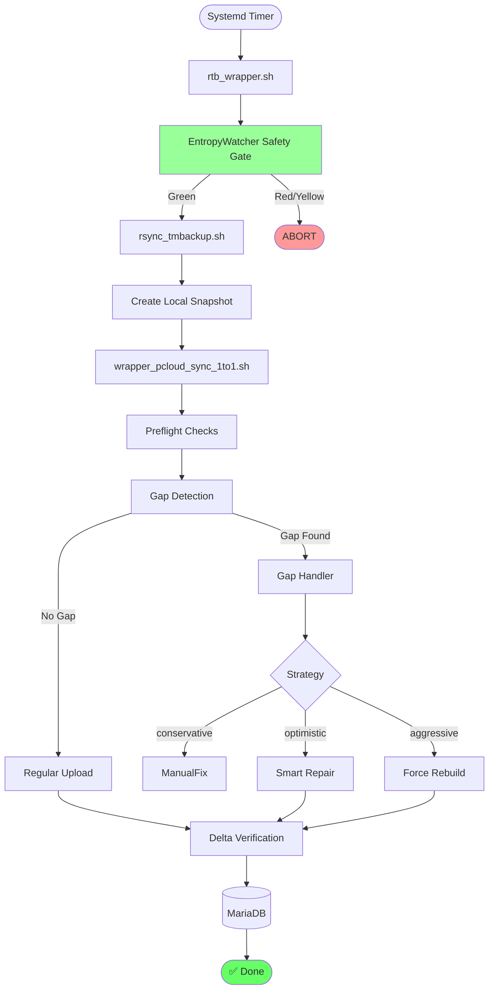

---

**📚 Weitere Dokumentation:**
- [GAP_HANDLING.md](GAP_HANDLING.md) - Vollständige Doku
- [GAP_HANDLING_QUICKSTART.md](GAP_HANDLING_QUICKSTART.md) - Quick-Start
- [GAP_HANDLING_FAQ.md](GAP_HANDLING_FAQ.md) - FAQ

---

*Diagramme generiert mit Mermaid.js*  
*Letzte Aktualisierung: 2026-04-16*
